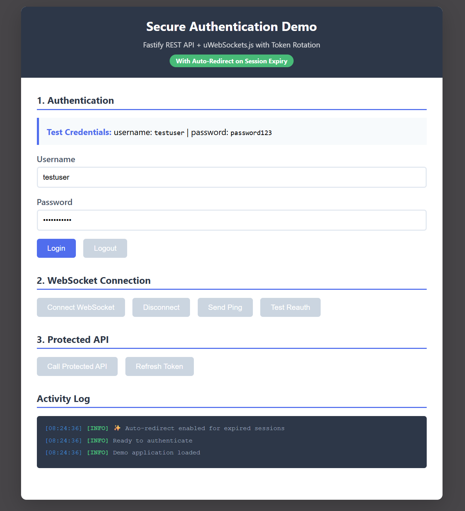

# Secure Authentication System


A production-ready authentication system combining Fastify REST API and uWebSockets.js for real-time communication, featuring JWT-based authentication with automatic token rotation and refresh token families.



## Architecture

- **Fastify API**: REST endpoints for authentication and business logic
- **uWebSockets.js**: High-performance WebSocket server for real-time communication
- **PostgreSQL**: User data and refresh token storage
- **Nginx**: Reverse proxy with rate limiting
- **Docker Compose**: Complete containerized deployment

## Key Features

### Authentication
- Secure login/logout with bcrypt password hashing
- JWT access tokens (RS256) with 15-minute expiry
- HTTP-only refresh tokens with 7-day expiry
- Automatic token rotation on refresh
- Token family tracking for replay attack prevention

### Security
- RS256 asymmetric encryption (2048-bit keys)
- Refresh token families prevent token reuse attacks
- Token revocation on logout and security events
- Rate limiting on authentication endpoints (configurable)
- Secure cookie handling (HttpOnly, Secure, SameSite)

### Real-Time Communication
- WebSocket authentication using JWT access tokens
- Automatic token expiry detection (2-minute warning)
- Seamless re-authentication without disconnection
- WebSocket-specific state management (presence, typing indicators)

### Token Management
- Access tokens: Short-lived (15 min), bearer tokens for API requests
- Refresh tokens: Long-lived (7 days), HTTP-only cookies for token renewal
- Automatic refresh before expiry
- Token family-based revocation cascade
- Session expiry with automatic redirect

## Project Structure

```
fastify-uws-auth/
├── docker-compose.yml          # Orchestrates all services
├── docker-compose.dev.yml      # Dev mode override
├── generate-keys.sh            # Generate RSA keypair
├── start.sh                    # Quick start script
├── README.md                   # Main documentation
├── SECURITY.md                 # Security documentation
├── client-demo.html            # Interactive demo
├── .gitignore                  # Git ignore rules
│
├── keys/                       # RSA keys (gitignored)
│   ├── private.pem             # Private key for signing
│   └── public.pem              # Public key for verification
│
├── nginx/
│   └── nginx.conf              # Reverse proxy config
│
├── postgres-init/
│   └── 01-init.sql             # Database schema
│
├── fastify-api/                # REST API Server
│   ├── Dockerfile
│   ├── package.json
│   ├── tsconfig.json
│   └── src/
│       ├── index.ts            # Server entry point
│       ├── routes.ts           # Auth endpoints
│       ├── database.ts         # Database layer
│       └── jwt.ts              # JWT utilities
│
└── uws-server/                 # WebSocket Server
    ├── Dockerfile
    ├── package.json
    ├── tsconfig.json
    └── src/
        ├── index.ts            # WebSocket server
        └── jwt.ts              # JWT verification
```

## Quick Start

### Prerequisites
- Docker and Docker Compose
- Node.js 20+ (for local development)
- OpenSSL (for key generation)

### Setup

1. Clone the repository
2. Run the setup script:
   ```bash
   ./start.sh
   ```

This will:
- Generate RSA keys if not present
- Create package-lock.json files
- Build Docker images
- Start all services
- Initialize database with test user

### Manual RSA Key Pair Generation

```bash
chmod +x generate-keys.sh
./generate-keys.sh
```

This creates:
- `keys/private.pem` - Private key for signing JWTs (keep secure!)
- `keys/public.pem` - Public key for verification

### Access

- Web Interface: http://localhost
- Fastify API: http://localhost/api
- WebSocket: ws://localhost/ws
- Health Check: http://localhost/health

### Test Credentials

- Username: `testuser`
- Password: `password123`

## API Endpoints

### Authentication

**POST /api/login**
- Request: `{ "username": "string", "password": "string" }`
- Response: `{ "accessToken": "string", "user": { "id": number, "username": "string" } }`
- Sets HTTP-only refresh token cookie

**POST /api/logout**
- Requires: Refresh token cookie
- Revokes refresh token and clears cookie

**POST /api/refresh**
- Requires: Refresh token cookie
- Response: `{ "accessToken": "string" }`
- Rotates refresh token automatically

### Protected Routes

**GET /api/protected**
- Requires: `Authorization: Bearer <access_token>`
- Response: `{ "message": "string", "user": { ... } }`

**GET /api/health**
- Public health check endpoint
- Response: `{ "status": "ok", "timestamp": "ISO-8601" }`

## WebSocket Protocol

### Connection
```
ws://localhost/ws?token=<access_token>
```

### Message Types

**Client to Server:**
```javascript
{ "type": "ping" }
{ "type": "reauth", "access": "<new_access_token>" }
```

**Server to Client:**
```javascript
{ "type": "connected", "payload": { "userId": number, "username": "string" } }
{ "type": "pong", "payload": { "timestamp": number } }
{ "type": "token_expiring", "payload": { "expiresAt": number } }
{ "type": "error", "payload": { "message": "string", "requireReauth": boolean } }
```

## Token Flow

### Initial Login
1. User submits credentials
2. Server validates and creates token family
3. Server issues access token (JWT) and refresh token
4. Refresh token stored in database and sent as HTTP-only cookie
5. Access token returned in response body

### Token Refresh
1. Client sends refresh token cookie to /api/refresh
2. Server verifies token and checks revocation status
3. Server marks old token as used
4. Server generates new access token and refresh token (same family)
5. New tokens returned/set

### Token Expiry
1. Access token expires after 15 minutes
2. WebSocket detects expiry 2 minutes before
3. Client automatically refreshes tokens
4. Client re-authenticates WebSocket with new access token
5. Connection remains active throughout

### Security Event (Replay Attack)
1. Revoked token is reused
2. Server detects token reuse
3. Server revokes entire token family
4. User forced to re-authenticate

## Configuration

### Environment Variables

**Fastify API:**
- `PORT`: API port (default: 3000)
- `DB_HOST`: PostgreSQL host (default: postgres)
- `DB_PORT`: PostgreSQL port (default: 5432)
- `DB_USER`: Database user (default: authuser)
- `DB_PASSWORD`: Database password (default: authpass)
- `DB_NAME`: Database name (default: authdb)
- `PRIVATE_KEY_PATH`: Path to RSA private key
- `PUBLIC_KEY_PATH`: Path to RSA public key
- `ACCESS_TOKEN_EXPIRY`: Access token lifetime (default: 15m)
- `REFRESH_TOKEN_EXPIRY`: Refresh token lifetime (default: 7d)

**uWebSockets.js:**
- `PORT`: WebSocket port (default: 3001)
- `PUBLIC_KEY_PATH`: Path to RSA public key

**Nginx:**
- Rate limit: 30 requests/minute (configurable in nginx.conf)
- Burst: 10 requests

## Database Schema

### users
- `id`: Serial primary key
- `username`: Unique username
- `password_hash`: Bcrypt hashed password
- `created_at`: Account creation timestamp

### refresh_tokens
- `id`: Serial primary key
- `user_id`: Foreign key to users
- `token_hash`: SHA-256 hash of token
- `token_family`: UUID for token family tracking
- `expires_at`: Token expiration timestamp
- `is_revoked`: Revocation flag
- `revoked_at`: Revocation timestamp
- `created_at`: Token creation timestamp
- `last_used_at`: Last usage timestamp

## Development

### Local Development

```bash
# Install dependencies
cd fastify-api && npm install
cd ../uws-server && npm install

# Run services
docker compose up -d

# View logs
docker compose logs -f

# Stop services
docker compose down
```

## Security Best Practices

1. **Key Management**: RSA keys are gitignored and must be generated per environment
2. **Password Storage**: Bcrypt with salt rounds of 10 (configurable)
3. **Token Storage**: Refresh tokens stored as SHA-256 hashes in database
4. **Cookie Security**: HTTP-only, Secure (HTTPS only), SameSite=Strict
5. **Rate Limiting**: Prevents brute force attacks on authentication endpoints
6. **Token Families**: Prevents token replay attacks through family-based revocation
7. **Database Cleanup**: Automatic cleanup of expired tokens

## Production Considerations

1. Use environment-specific RSA keys (do not share between environments)
2. Enable HTTPS/TLS termination at Nginx
3. Configure appropriate rate limits based on traffic patterns
4. Set up database backups and replication
5. Monitor token refresh patterns for anomalies
6. Implement log aggregation and alerting
7. Use secrets management for sensitive configuration
8. Consider shorter token lifetimes for high-security applications

## Technology Stack

- **Language**: TypeScript
- **Runtime**: Node.js 20
- **REST Framework**: Fastify 4.x
- **WebSocket**: uWebSockets.js (native C++ bindings)
- **Database**: PostgreSQL 16
- **Reverse Proxy**: Nginx
- **Authentication**: JWT (jsonwebtoken)
- **Password Hashing**: bcrypt
- **Containerization**: Docker & Docker Compose

## License

This project is provided as-is for educational and production use.
MIT License - See LICENSE file for details

## Support

For issues, questions, or contributions, please refer to the project documentation or create an issue in the repository.
